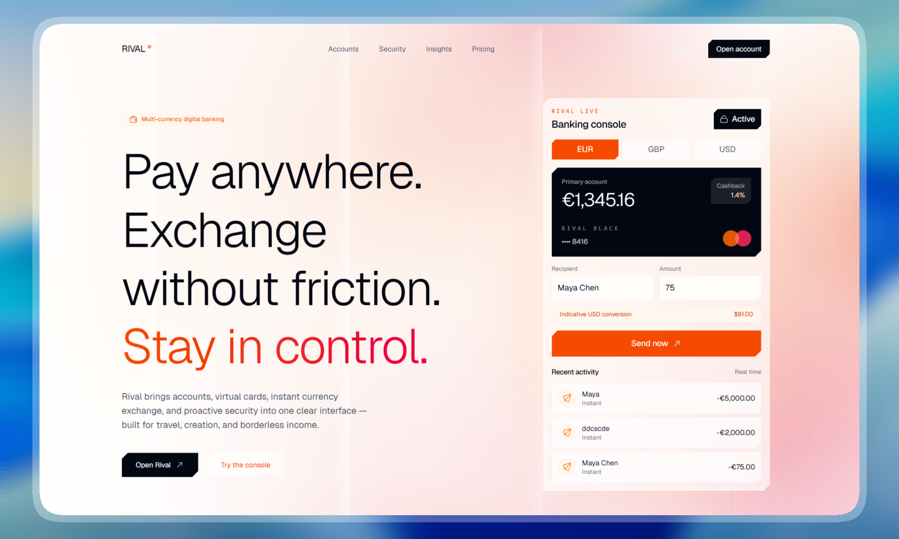

# 🚀 Rival Landing Page
> **Day 6/30 of the "Building 1 AI-Generated Landing Page Every Day" Challenge**



## 🚀 About

Conceptual landing page for **Rival**, a **next-gen digital bank for global citizens**, developed with **Next.js 16**, **TypeScript**, and **Tailwind CSS 4**. This project is the sixth realization of an ambitious challenge: creating **1 complete and functional mockup per day using AI**.

Rival is designed for the modern global traveler and wealth builder. The goal is to instantly convey **security**, **fluidity**, **premium service**, and **global reach** through a deep-toned, glass-led, high-end finance aesthetic.

Live URL: [https://rival-landing.adrielzimbril.com](https://rival-landing.adrielzimbril.com)

## 🎨 Design & Aesthetic Decisions (The "Why")

For this sixth day, the chosen theme revolves around **fintech, global banking, wealth management, and seamless financial flows**.

- **Deep Premium Surface:** The interface relies on a dark obsidian background, sharp typography, glassmorphism card treatments, and subtle blue accents to feel secure, calm, and expensive.
- **Product-Led Signal:** Real banking features like multi-currency wallets, high-yield savings, and instant transfers are placed directly in the bento grid and hero section so the product promise is visible immediately.
- **Purposeful Interaction:** Interactive cards simulate transaction flows, card management, investment growth, and security toggles. Motion supports the banking story instead of animating text for decoration.
- **High-End Finance Rhythm:** The layout uses a floating navigation, bento-style feature panels, testimonial carousel, and a modern footer to communicate a polished SaaS tool made for global citizens.
- **Digital Bank Brand Mark:** The favicon and site logo use a sharp, minimal geometric mark, tying the brand identity to precision, balance, and modern financial structure.

## 🧩 Key Sections

- **🌟 Hero Header:** Designed to grab attention in the first 3 seconds with large typography, a floating navigation, and a high-fidelity mobile mockup showing the Rival app in action.
- **🖼️ Trust Marquee:** A smooth sliding marquee of partner logos and security certifications to establish immediate credibility.
- **🧠 Interactive Features Bento:** Simulates a banking dashboard with selectable wallets, yield projections, security controls, and global spend reporting cards.
- **💬 Testimonials Carousel:** A smooth, interactive sliding section featuring customer feedback and trust indicators.
- **💳 Pricing & FAQ System:** Three account tiers (Starter, Scale, Enterprise) with an interactive billing toggle and a clean accordion-style FAQ section.
- **🏢 Modern Footer:** A restrained brand close with contact routes, product links, legal links, and a polished final conversion area.

## 🛠️ Tech Stack

This mockup was built with cutting-edge technologies from the React ecosystem:

- **[Next.js 16](https://nextjs.org/)** (App Router)
- **[React 19](https://react.dev/)**
- **TypeScript** for scalable component architecture and safer iteration.
- **[Tailwind CSS v4](https://tailwindcss.com/)** for design tokens, utilities, and modern CSS support.
- **[Motion/React](https://motion.dev/)** (formerly Framer Motion) for high-performance finance-grade transitions and layouts.
- **[Lucide React](https://lucide.dev/)** for clean, consistent iconography.
- **Next Font** with **Plus Jakarta Sans** and **Geist** for optimized display typography.

## 🚀 Quick Start

```bash
# Install dependencies
pnpm install

# Run development server
pnpm dev
```

Open [http://localhost:3000](http://localhost:3000) in your browser to see the result.

## 🌌 Let's meet in space (or on Earth) 🚀

I'm always happy to discuss new projects, collaborations, or simply exchange creative ideas. Here's how to contact me:

- **📧 Email**: [hello@adrielzimbril.com](mailto:hello@adrielzimbril.com)
- **🌐 Website**: [https://www.adrielzimbril.com](https://www.adrielzimbril.com)
- **🐦 Twitter**: [https://twitter.com/adrielzimbril](https://twitter.com/adrielzimbril)
- **💼 LinkedIn**: [https://www.linkedin.com/in/adrielzimbrilcode](https://www.linkedin.com/in/adrielzimbrilcode)
- **🐼 GitHub**: [https://github.com/adrielzimbril](https://github.com/adrielzimbril)

### 🐼 Fun Facts

- 🚀 Passionate about space exploration and technology
- 🐼 Love pandas (and animals in general!)
- 🎨 Creative at heart, whether in design or code
- ☕ Addicted to coffee and complex technical challenges

## 🌟 Join the Adventure

If you like this project, feel free to:

- ⭐ Star the project
- 🐞 Report bugs
- ✨ Suggest improvements
- 🚀 Share with other enthusiasts

## 💖 Support the Project

If you find this project useful and would like to support its development, you can do so through these platforms:

- [](https://go.adrielzimbril.com/gs)

## 🌐 Hosting

This project is 100% hosted on modern cloud infrastructure for maximum performance and reliability:

- [](https://vercel.com)

## 📄 License

This project is under the MIT license. Feel free to use it as a base for your own portfolio or project.

---

**Developed with ❤️ by Adriel Zimbril**  
_Product Designer & Fullstack Developer_  
🚀 Digital Universe Explorer | 🐼 Panda Friend | 🎨 Passionate Creator
